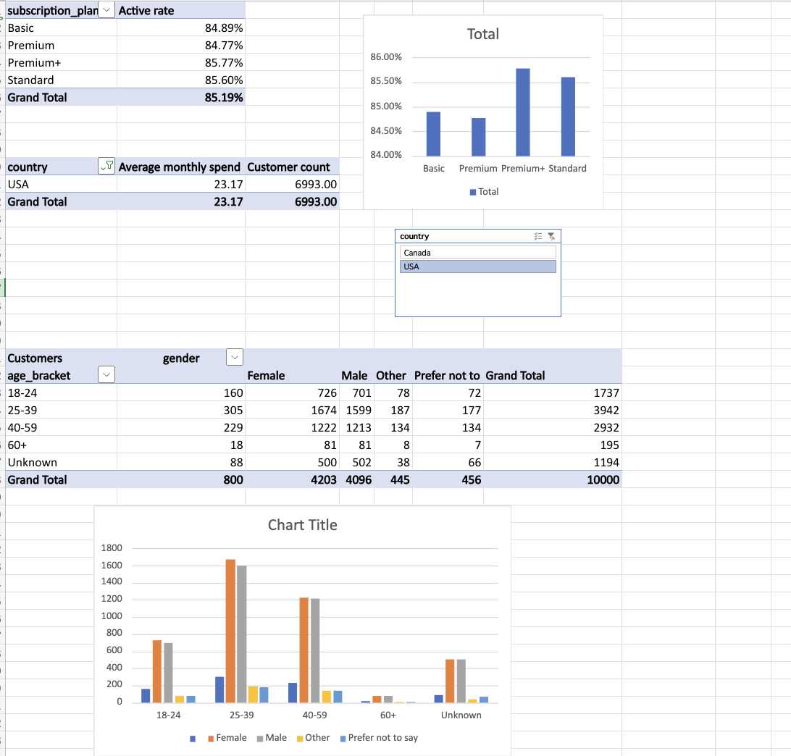

# Subscriber Retention Analysis
### Mint Menakanit

----

This project is built to analyze subscriber retention, revenue and userbase built to demonstrate business analytic skills.

----
## Tools used

- **SQL (SQLite)**
- **Excel Power Query**
- **Excel Pivot Tables**

----
## Goal

By analyzing ~10,000 Netflix subscriber accounts/users data, we find 
- churn rate (customer loss by plan)
- revenue concentration by plan and country
- demographic patterns

----
## Data

Netflix user behavior dataset
~10,300 rows including user data, subscription plan, activity status

Source : 'https://www.kaggle.com/datasets/sayeeduddin/netflix-2025user-behavior-dataset-210k-records'

----
## Schema

- **customer** : user_id , first_name, last_name, email, age, gender, country, state_province. city, created_at
- **subscription plan** : user_id, subscription_plan, subscription_start_date, is_active, monthly_spend, primary_device, household_size

----
## Key SQL queries

Full scripts: 'sql/01_schema.sql' , 'sql/02_analysis' , 'sql/03_joint-csv'

----
## Dashboard

Full excel sheet : 'excel/netflix_analysis_excel.xlsx'

----
## Findings

- Highest churn rate : 15.23% from Premium plan (Active rate 84.77%)
- Comparison between USA and Canada average monthly spend : USA has higher monthly spend
- Age and gender demographic : Age 18-25 has the most grand total plan subscription. Except for 60+, female has a higher total subsciption plan by all age than male.

----
